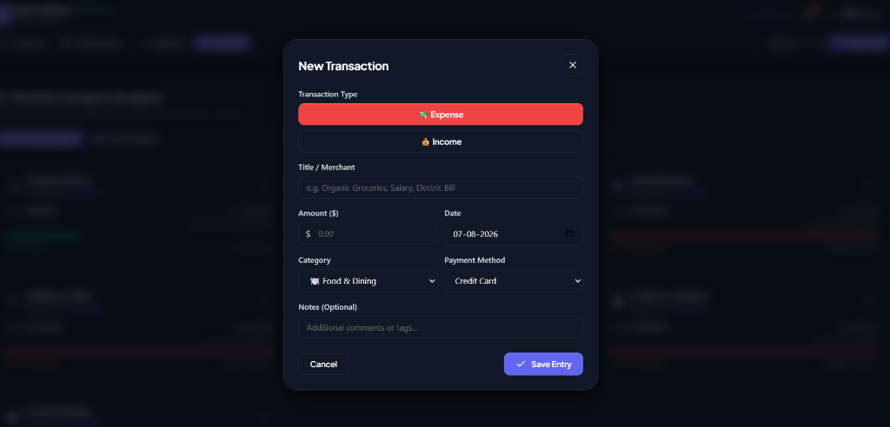
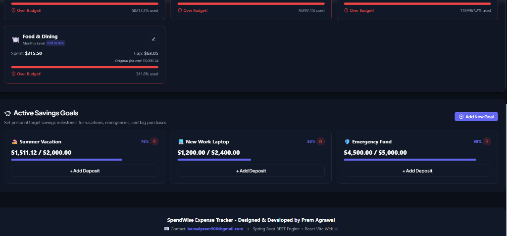
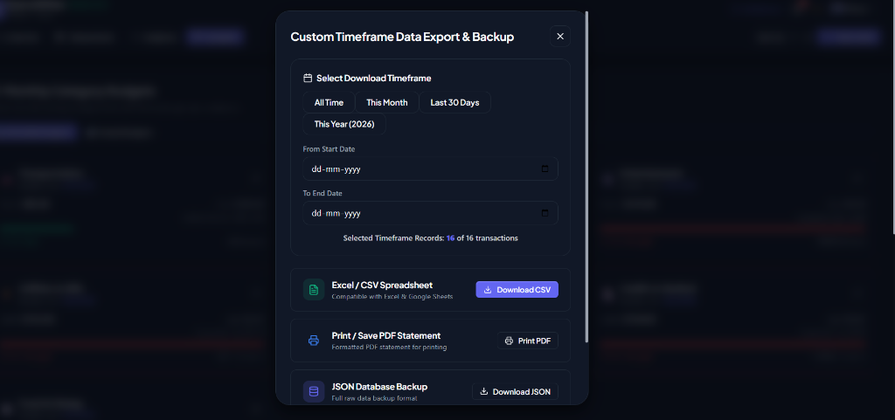

# 💳 SpendWise – Java Full Stack Expense & Financial Analytics Dashboard

[](https://www.oracle.com/java/)
[](https://spring.io/projects/spring-boot)
[](https://www.docker.com/)
[](https://react.dev/)
[](https://vitejs.dev/)
[](https://www.postgresql.org/)
[](https://web.dev/progressive-web-apps/)

**SpendWise** is a production-grade, human-engineered **Java Full Stack Financial Intelligence Application**. It combines a high-performance **Spring Boot 3 REST API backend** with a modern **React 18 single-page web UI** featuring glassmorphism aesthetics, live real-time forex currency conversions, interactive Chart.js analytics, monthly & yearly category budget caps, automated cash balance deductions on savings deposits, and multi-device cloud database synchronization.

---

## 📸 Visual Showcase & Application Screenshots

### 1. 🎯 Monthly Category Budgets & Live Forex Conversion
Real-time multi-currency category budget limits stored in original fed currency and converted dynamically across display currencies (`USD`, `EUR`, `GBP`, `INR`, `JPY`, `CAD`, `AUD`) with automated over-budget alerts.



---

### 2. 💸 Income & Expense Transaction Workbench
Sleek modal for recording new income or expense transactions with merchant titles, custom amounts, transaction date selection, category tags, and payment method badges.



---

### 3. 🐷 Interactive Active Savings Goals & Automated Cash Deductions
Define personal savings milestones (Vacation, Laptop, Emergency Fund) with target progress bars, percentage tracking, and **automated cash balance deductions** when adding deposits.


---

### 4. 📥 Custom Timeframe Data Export & PDF Statement Generator
Filter transaction records by custom start/end date ranges (`From Date` – `To Date`) or preset timeframes, then export to **Excel CSV**, **JSON Backup**, or print a formatted **PDF Statement**.



---

## ✨ Key Features & Capabilities

### 1. 📊 Financial Intelligence Dashboard & Analytics
- **KPI Metrics**: Real-time Total Balance, Cash Inflow, Outflow, and Net Savings Rate %.
- **12-Month Breakdown & Yearly Analysis**: Multi-period bar charts comparing Income vs Outflow per month for any selected year (2020 through 2030 + All Years).
- **Interactive Visualizations**: Cash flow trend line charts & category spending doughnut breakdowns with percentage legends using **Chart.js**.

### 2. 💱 Real-Time Live Forex Exchange Rates & Multi-Currency System
- Live currency API integration (`open.er-api.com`) fetching real-time exchange rates.
- Instant conversion between **USD ($)**, **EUR (€)**, **GBP (£)**, **INR (₹)**, **JPY (¥)**, **CAD (CA$)**, and **AUD (A$)**.
- **Fed-Currency Budget Storage**: Stores budget caps in whichever currency fed by the user and dynamically converts to any header display currency in real time.

### 3. 🎯 Monthly & Yearly Category Budgets
- Set monthly or annual spending caps per category (Food, Housing, Transport, Entertainment, Utilities, Health, Shopping, etc.).
- Real-time limit progress bars with automated alerts:
  - ⚠️ **Warning Alert**: Triggered at 80%+ category limit.
  - 🚨 **Exceeded Alert**: Triggered when spending passes 100% capacity.

### 4. 🐷 Dynamic Active Savings Goals
- Create personal target savings goals (Vacation, Emergency Fund, Laptop).
- **Automated Cash Deduction**: Depositing money into a savings goal automatically creates an outflow transaction, deducting the deposit from your available cash balance.

### 5. 🔍 Specific Date Filtering & Custom Timeframe Exports
- **Specific Date Filter**: Filter transaction history by exact calendar date (`YYYY-MM-DD`).
- **Custom Timeframe Export**: Filter transaction records by custom start/end date ranges and download **CSV**, **JSON**, or printable **PDF Statements**.

### 6. 📸 Profile Picture Upload & Lightbox Preview
- Upload photo from device, paste web URL, or choose preset avatars.
- **Fullscreen Lightbox**: Click profile photo anytime to preview in fullscreen backdrop-blur view.

### 7. 🔄 Continuous Real-Time Sync & Persistent Sessions
- **8-Second Background Polling**: Syncs data continuously across connected devices.
- **Persistent Sessions**: User remains signed in on refresh until explicitly clicking **Log Out**.

---

## 🏗️ Architecture & Technology Stack

```
               ┌────────────────────────────────────────────────────────┐
               │    React 18 + Vite Web Frontend (Port 5173 / 5174)    │
               │    - Linear/Stripe Obsidian Design System (CSS)        │
               │    - Chart.js, Lucide Icons, AI Advisor, PWA Manifest  │
               └───────────────────────────┬────────────────────────────┘
                                           │ REST API (JSON)
                                           ▼
               ┌────────────────────────────────────────────────────────┐
               │    Java 17 Spring Boot 3 Backend API (Port 8080)       │
               │    - Controllers: Transaction, Analytics, Budget, Auth │
               │    - Services: TransactionService, BudgetService, Auth  │
               │    - Multi-stage Dockerfile Packaging                  │
               └───────────────────────────┬────────────────────────────┘
                                           │ JDBC Persistence
                                           ▼
               ┌────────────────────────────────────────────────────────┐
               │    Database Tier (H2 Local / PostgreSQL Cloud)         │
               │    - Transactions, Budgets, Users Tables               │
               └───────────────────────────┬────────────────────────────┘
```

| Layer | Technology |
| :--- | :--- |
| **Backend Framework** | Java 17, Spring Boot 3.2.3, Spring Data JPA, Spring Web |
| **Packaging & Docker**| Multi-stage `Dockerfile` (`maven:3.9.6` & `eclipse-temurin:17-alpine`) |
| **Database** | H2 Database (Dev) / PostgreSQL (Production Cloud) |
| **Security** | SHA-256 / BCrypt Password Hashing (`PasswordEncoderUtil`) |
| **Frontend Framework**| React 18, Vite 5, JavaScript (ES6+) |
| **UI & Styling** | Custom Obsidian CSS Design System, Lucide Icons |
| **Data Viz** | Chart.js 4, `react-chartjs-2` |
| **Forex API** | Open Exchange Rates API (`open.er-api.com`) |
| **PWA** | Web App Manifest (`manifest.json`), Service Worker (`sw.js`) |

---

## ⚡ Getting Started (Local Setup)

### Prerequisites
- **Java 17 or higher** installed
- **Node.js 18 or higher** & `npm` installed
- Maven (or embedded Maven Wrapper)

---

### Step 1: Run the Backend (Java Spring Boot)

```bash
cd backend
mvn spring-boot:run
```

Once started:
- 🌐 REST API Endpoint: `http://localhost:8080/api/v1/transactions`
- 🗄️ Embedded H2 Console: `http://localhost:8080/h2-console` (JDBC URL: `jdbc:h2:mem:spendwisedb`, User: `sa`, Password: *blank*)

---

### Step 2: Run the Frontend (React + Vite)

Open a new terminal window:

```bash
cd frontend
npm install
npm run dev
```

Open your browser and navigate to:
👉 **`http://localhost:5173/`**

---

## 📡 REST API Documentation

### Transactions API
| Method | Endpoint | Description |
| :--- | :--- | :--- |
| `GET` | `/api/v1/transactions` | Fetch transactions (Supports `type`, `category`, `search`, `userId` query params) |
| `POST` | `/api/v1/transactions` | Create a new income or expense transaction |
| `PUT` | `/api/v1/transactions/{id}` | Update existing transaction record |
| `DELETE` | `/api/v1/transactions/{id}` | Delete transaction record |

### Analytics API
| Method | Endpoint | Description |
| :--- | :--- | :--- |
| `GET` | `/api/v1/analytics/summary` | Get Net Balance, Total Inflow, Total Outflow, & Savings Rate % |
| `GET` | `/api/v1/analytics/category-breakdown` | Get spending breakdown per category with percentages |

### Budgets & Auth API
| Method | Endpoint | Description |
| :--- | :--- | :--- |
| `GET` | `/api/v1/budgets/progress` | Fetch monthly/yearly category budget limits & overflow warning status |
| `POST` | `/api/v1/budgets` | Set or update category budget cap with currency & period |
| `POST` | `/api/v1/auth/login` | Authenticate user credentials |
| `POST` | `/api/v1/auth/register` | Register a new user with encrypted password |
| `GET` | `/api/v1/auth/profile/{id}` | Fetch user profile and avatar URL |
| `PUT` | `/api/v1/auth/profile/{id}` | Update user profile and custom avatar URL |

---

## 👨‍💻 Developer & Contact

**SpendWise Expense Tracker** • Designed & Developed by **Prem Agrawal**  
📧 Contact Email: [bansalprem900@gmail.com](mailto:bansalprem900@gmail.com)

---

## 📝 License

Distributed under the MIT License. Feel free to fork, adapt, and use this project for learning or portfolio applications.
